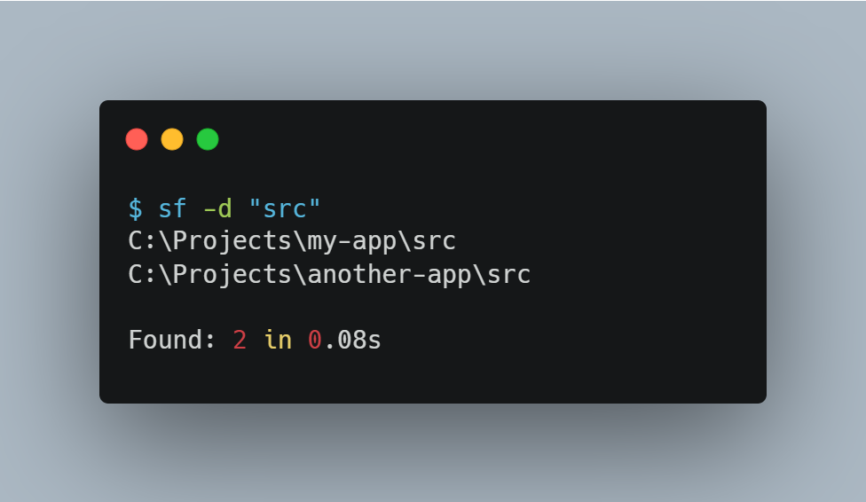

# sf - Simple File and Folder Search Utility


A fast and convenient command-line utility for searching files and directories, written in Rust.

## 🚀 Features

- Search files and folders by substring
- Support for glob patterns (`*`, `?`, `[]`)
- Case-sensitive and case-insensitive search
- Configurable recursion depth
- Custom starting directory for search

## 📦 Installation

### From Source

```bash
git clone https://github.com/istoriya-islama/sf---Search-Utility.git
cd sf
cargo build --release
```

The compiled binary will be located at `sf.exe` (Windows) or `sf` (Linux/macOS).

### Adding to PATH

For convenience, add the directory with the executable to your PATH or copy `sf.exe` to a directory already in your PATH.

## 🔧 Usage





### Basic Syntax

```bash
sf [OPTIONS] <PATTERN>
```

### Examples

**Searching for files:**
```bash
sf "config"                    # Find all files containing "config" in name
sf "*.txt"                     # Find all .txt files (requires -g)
sf -g "*.rs"                   # Find all Rust files (glob pattern)
```

**Searching for folders:**
```bash
sf -d "src"                    # Find all folders containing "src"
sf -d "test"                   # Find folders with "test" in name
```

**Case-insensitive search:**
```bash
sf -i "README"                 # Will find readme, README, ReadMe, etc.
```

**Specifying search directory:**
```bash
sf -s "C:\Projects" "main"     # Search in C:\Projects
sf -s "../" -d "docs"          # Search in parent directory
```

**Limiting search depth:**
```bash
sf -r 2 "config"               # Search only up to 2 levels deep
sf -r 0 "readme.md"            # Search only in current directory
```

**Combining options:**
```bash
sf -d -i -s "C:\Projects" "test"           # Folders with "test", case-insensitive
sf -g -r 3 "*.json"                        # JSON files up to 3 levels deep
sf -d -i -s "/home/user" -r 2 "downloads"  # Complex search
```

## ⚙️ Options

| Option | Long Form | Description |
|--------|-----------|-------------|
| `-d` | `--dir` | Search for directories instead of files |
| `-i` | `--ignore-case` | Ignore case when searching |
| `-s <PATH>` | `--start <PATH>` | Starting directory for search (default `.`) |
| `-r <NUM>` | `--max-depth <NUM>` | Maximum recursion depth (-1 = unlimited) |
| `-g` | `--glob` | Use glob patterns (`*`, `?`, `[]`) |
| `-h` | `--help` | Show help information |
| `-V` | `--version` | Show version |

## 📝 Notes

- By default, search starts in the current directory (`.`)
- Default recursion depth: `-1` (unlimited)
- To use glob patterns, you must specify the `-g` flag
- In PowerShell/CMD, it's recommended to use quotes for patterns with spaces

## 🛠️ Dependencies

- [clap](https://github.com/clap-rs/clap) - Command-line argument parsing
- [walkdir](https://github.com/BurntSushi/walkdir) - Recursive directory traversal
- [globset](https://github.com/BurntSushi/ripgrep/tree/master/crates/globset) - Glob pattern support

## 📄 License

This project is licensed under the GNU General Public License v3.0 - see the [LICENSE](LICENSE) file for details.

## 🤝 Contributing

Suggestions and pull requests are welcome!
